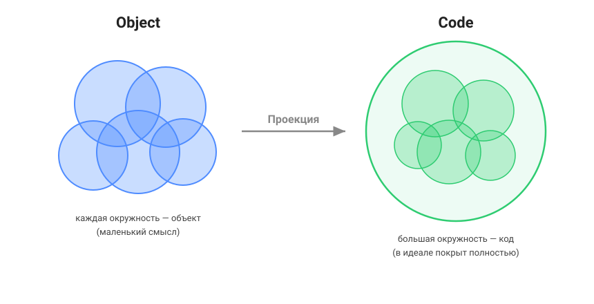

# Object Oriented Spec
Требования приходят **историями**, оседают в **объектах**, объекты проецируются в
**код**.

[story] ⇒ [object] → [code]

- **Story** — сырой голос пользователя: что он хочет и зачем. Нарратив, неполный,
  поперечный (одна история трогает много объектов). Это не спека, а датированная
  запись намерения — лог, как changelog.
- **Object** — дистиллят: объект предметной области, с которым работает конечный
  пользователь (Персонаж, Портал, Сердечко, Заявка). Нормализован, без дублей,
  полон, тестируем. Это **живая спека**.
- **Code** — реализация, проекция объектов.

Две стрелки — **разной природы**, и это главное:

- `story ⇒ object` — мягкая, односторонняя, генеративная. Истории *сеют и
  обновляют* объекты; с кодом не синхронизируются и не измеряются.
- `object → code` — жёсткая, поддерживаемая, **измеряемая** проекция. Её и меряет
  `/object-check` через ссылку `// object:`.

Каждый объект — маленький смысл (окружность). Код — большая окружность, которая
в идеале покрывает все объекты полностью. Стрелка между ними — «Проекция».

## Объект

Объект описывает сам себя языком пользователя, не программиста: что это, какие
состояния, как себя ведёт, с кем связан. Шаблон — `src/OBJECT.md`.

Формат один, но объект может крениться:
- **сущность** — суть в наборе поведений (Сердечко, Портал);
- **процесс** — суть в переходах между состояниями (Заявка, Заказ). Поток во
  времени — это объект-владелец потока со state-машиной, а не отдельная форма.

Взаимодействие двух объектов принадлежит **активному** (Портал перемещает,
Сердечко лечит); пассивный держит только свои инварианты (Персонаж: «здоровье ≤
макс»). Общее правило живёт у своего владельца один раз, а не дублируется.

## История

Истории живут в `stories/` как **append-only лог** намерений (удобно с датой в
имени: `2026-07-01-portals.md`). Старую историю не переписывают под новый код —
устаревшая история не «баг», это запись прошлого намерения. Истории не ссылаются
из тестов и не требуют уникальных имён — это забота объектов. «Зачем» из истории,
если оно неочевидно, оседает в объекте строкой «Назначение».

## Команды

`/architect` — обсуждение архитектуры; тут создаётся **скелет** приложения:
    файловая иерархия с `AGENTS.md` на каждом уровне (модуль, сервис, библиотека).

`/story` — снять историю с пользователя, записать в лог `stories/` и
    **дистиллировать** её в объекты `oos/` (разложить поведение по активным
    объектам).

`/object` — обсуждение объекта, его правка и — по явному указанию — правка кода.
    Объект **реализован**, если есть тесты, полностью покрывающие его поведение.
    Падающий тест — это «баг», который чинят, а не «не реализовано».

И одна вспомогательная, read-only:

`/object-check` — «прибор», измеряющий Проекцию `object → code`: сверяет поведение
    объекта с тестами по ссылке `// object:` и докладывает, что покрыто, чего нет,
    что падает. Ничего не пишет и не чинит — только отчёт.

## Правила

Работать через истории не обязательно — если источник уже понятен, идёшь сразу в
`/object`. Основная цель — собирать через конечного пользователя объекты
предметной области и реализовывать их.

Проект обязан иметь как можно больше тестов — они переносят смысл объекта в код.
Минимум: unit и e2e. Тест, покрывающий объект, обязан в комментарии ссылаться на
него: `// object: <имя-файла-без-расширения>`.

Имя файла объекта уникально внутри `oos/` (включая вложенные папки) — так ссылки
не ломаются при реорганизации папок.
